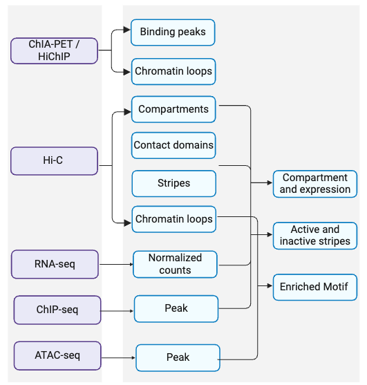

### Datasets overview

The datasets distribution by tissue, data types, biomaterial types and source health status are plotted below.

### Data Processing Workflow

1. Hi-C Data:
Contact matrix, compartments, contact domains, stripes and chromatin loops are identified using [4DN standards](https://data.4dnucleome.org/resources/data-analysis/hi_c-processing-pipeline).

2. ChIA-PET / HiChIP Data:
ChIA-PET data were processing using [ENCODE standard](https://www.encodeproject.org/pipelines/ENCPL169TBL/). HiChIP data were processed using HiC-Pro (PMID: 26619908).

3. RNA-seq Data:
- Normalized Counts: Process RNA-seq data to obtain normalized expression counts, facilitating the analysis of gene expression levels across different samples.

4. ChIP-seq Data:
- Peak: Identify peaks in ChIP-seq data, representing sites of protein binding or histone modifications.

5. ATAC-seq Data:
- Peak: Detect open chromatin regions through peak calling in ATAC-seq data, indicating regions of potential regulatory activity.

### Integration and Analysis:
1. Compartment and Expression Analysis: Correlate the identified compartments with gene expression data to elucidate the relationship between chromatin organization and transcriptional activity.
2. Active and Inactive Stripes: Analyze stripes in conjunction with ChIP-seq data to determine their active or repressive nature based on associated histone marks.
3. Enriched Motif Analysis: Utilize ATAC-seq data to identify enriched motifs, helping to predict transcription factor binding sites of chromatin loops anchors.