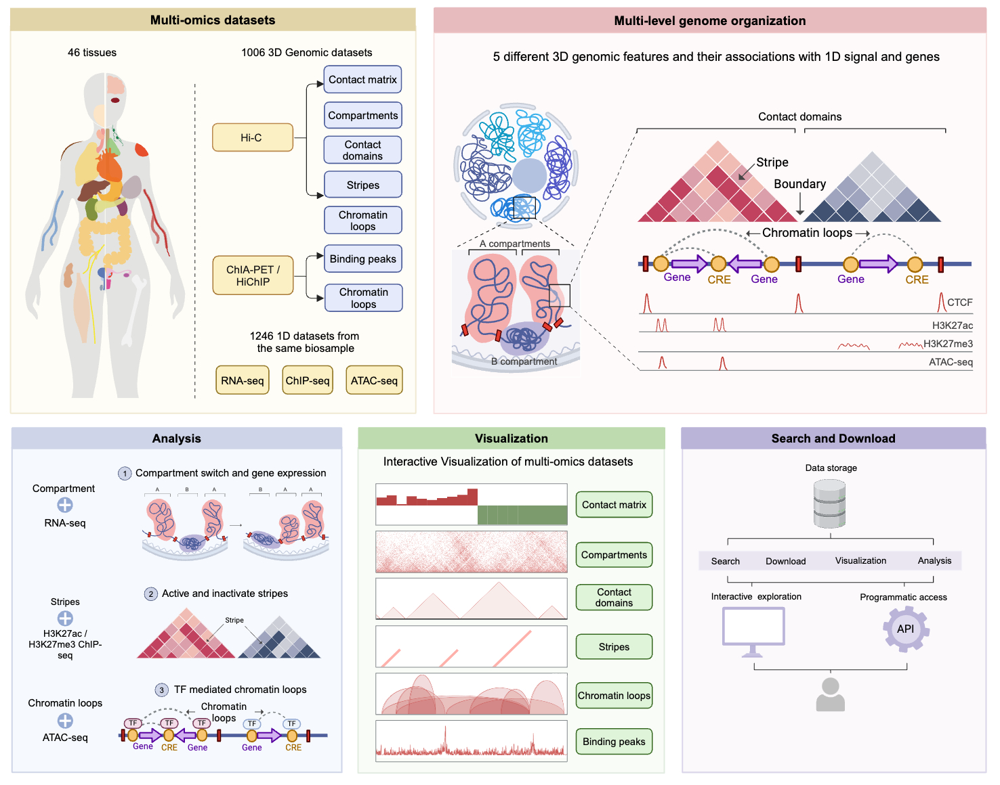

The human genome exhibits a complex hierarchical 3D organization. Utilizing genome-wide 3D genome mapping technologies such as Hi-C, HiChIP, and ChIA-PET, the spatial structure of the 3D genome can be parsed and visualized at multiple levels, including megabase-scale A/B compartments, submegabase-scale topologically associated domains (TADs), stripes, and kilobase-scale chromatin loops. 

3D genome organization is frequently linked to long-distance gene regulation, which in turn controls development and cell fate commitment. For example, the spatial segregation of chromatin into A and B compartments is a hallmark of genome organization and is associated with distant gene expression. Stripes, recently observed in Hi-C maps, provide evidence for the loop extrusion model. These stripes are enriched in super enhancers (H3K27ac signals), though repressive stripes (H3K27me3 signals) are also observed. Transcription factors can induce successive changes in chromatin state and genome architecture, enabling gene-regulatory rewiring during cell reprogramming. However, the multi-layered 3D genome organization and its relationship with the epigenome and gene expression within complex tissue organs and diverse cell types remain largely unknown. 

Here, we present **EXPRESSO (Exploration of Regulatory Epigenome with Spatial and Sequence Observations)**, a multi-omics database designed to explore and visualize multi-layered 3D genomic features and their associations with the epigenome and gene expression across 46 different tissues in the human genome. 

EXPRESSO is designed to support researchers in the exploration and analysis of multi-omics
 data. 
Key features of EXPRESSO include: 

1. Collection of 1094 3D genomic datasets (Hi-C, ChIA-PET, HiChIP) from public repositories, and 1246 1D datasets (RNA-seq, CTCF/H3K27ac/H3K27me3 ChIP-seq, and ATAC-seq) from the same studies that generated the 3D genomic datasets. 

2. Uniform processing of all datasets, with various 3D genomic features (contact matrix, compartments, contact domains, stripes, chromatin loops) available to the community. 

3. Development of multi-omics analyses applications, including: 

- a. Investigating the associations between compartment switches and gene expression variations. 

- b. Assessing the characteristics of active and repressed stripes. 

- c. Identifying transcription factors that mediate chromatin loops. 

4. Interactive visualization of all 3D genomic features using an in-house genome browser. 

5. Development of a REST API to allow programmatic access to most functionalities, in addition to interactive data exploration on the website.  
