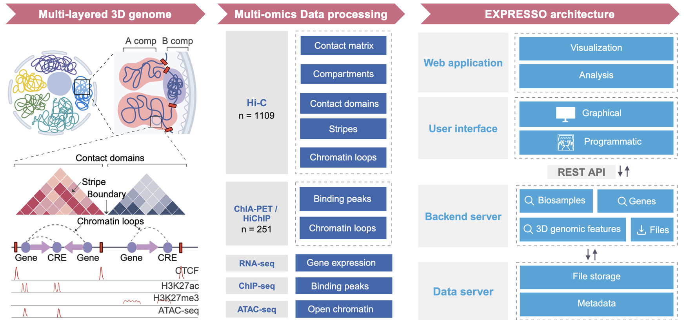
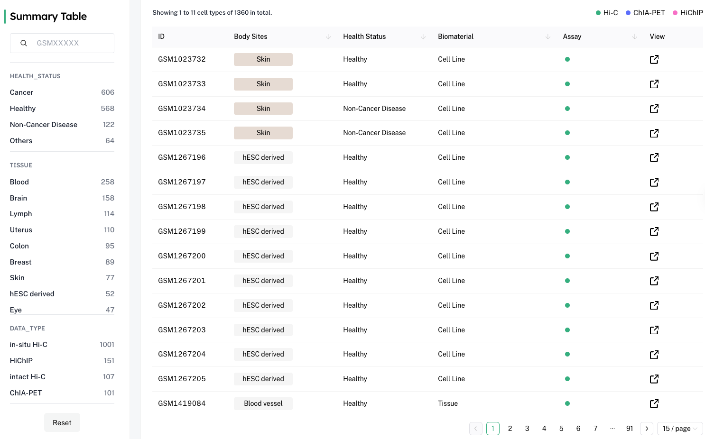
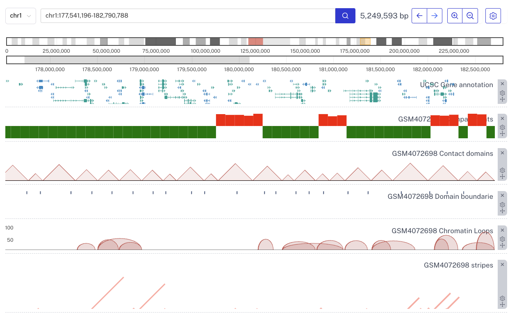
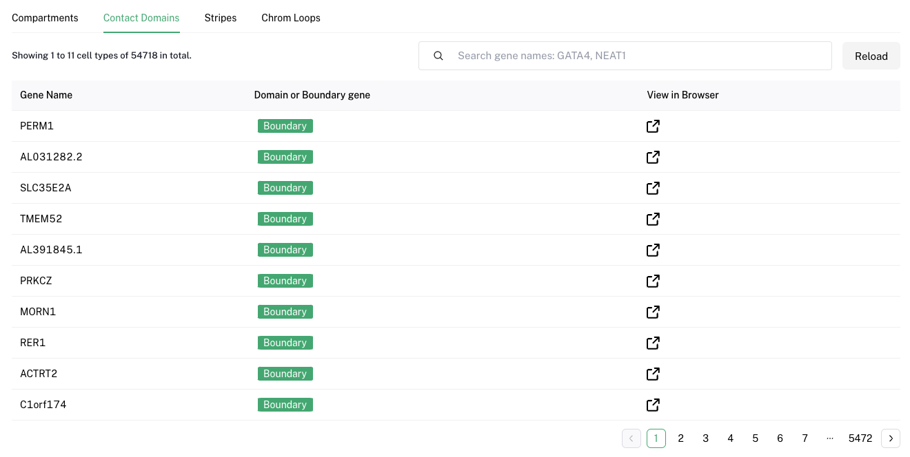

# EXPRESSO

The human genome exhibits a complex hierarchical 3D organization. Utilizing genome-wide 3D genome mapping technologies such as Hi-C, HiChIP, and ChIA-PET, the spatial structure of the 3D genome can be parsed and visualized at multiple levels, including megabase-scale A/B compartments, submegabase-scale topologically associated domains (TADs), stripes, and kilobase-scale chromatin loops. 

3D genome organization is frequently linked to long-distance gene regulation, which in turn controls development and cell fate commitment. For example, the spatial segregation of chromatin into A and B compartments is a hallmark of genome organization and is associated with distant gene expression. Stripes, recently observed in Hi-C maps, provide evidence for the loop extrusion model. These stripes are enriched in super enhancers (H3K27ac signals), though repressive stripes (H3K27me3 signals) are also observed. Transcription factors can induce successive changes in chromatin state and genome architecture, enabling gene-regulatory rewiring during cell reprogramming. However, the multi-layered 3D genome organization and its relationship with the epigenome and gene expression within complex tissue organs and diverse cell types remain largely unknown. 

Here, we present **EXPRESSO (Exploration of Regulatory Epigenome with Spatial and Sequence Observations)**, a multi-omics database designed to explore and visualize multi-layered 3D genomic features and their associations with the epigenome and gene expression across 46 different tissues in the human genome. 

---

## Contents
1. [Introduction](#introduction)
2. [Datasets](#datasets)
3. [Search Samples](#search-samples)
4. [Search Genes](#search-genes)
5. [Multi-omics Analysis](#multi-omics-analysis)
   - [Gene Compartment and Expression](#gene-compartment-and-expression)
   - [Stripe Atlas](#stripe-atlas)
   - [Chromatin Loop Enriched Transcription Factors](#chromatin-loop-enriched-transcription-factors)
6. [Download](#download)
7. [API](#api)

---

## Introduction

EXPRESSO is designed to support researchers in the exploration and analysis of multi-omics
 data. 
Key features of EXPRESSO include: 

1. Collection of 1094 3D genomic datasets (Hi-C, ChIA-PET, HiChIP) from public repositories, and 1246 1D datasets (RNA-seq, CTCF/H3K27ac/H3K27me3 ChIP-seq, and ATAC-seq) from the same studies that generated the 3D genomic datasets. 

2. Uniform processing of all datasets, with various 3D genomic features (contact matrix, compartments, contact domains, stripes, chromatin loops) available to the community. 

3. Development of multi-omics analyses applications, including: 

- a. Investigating the associations between compartment switches and gene expression variations. 

- b. Assessing the characteristics of active and repressed stripes. 

- c. Identifying transcription factors that mediate chromatin loops. 

4. Interactive visualization of all 3D genomic features using an in-house genome browser. 

5. Development of a REST API to allow programmatic access to most functionalities, in addition to interactive data exploration on the website.  

---

## Datasets

The datasets distribution by tissue, data types, biomaterial types and source health status are plotted below.

---

## Navigation Menu

You can navigate through the **EXPRESSO** platform using various menus to access specific functionalities:

- **Data Portal**: Search for individual samples based on various criteria. [Search in Data Portal](#data-portal)
- **Gene Search**: Look up individual genes to view detailed information and analytics. [Search Genes](#gene-search)
- **Multi-Omics Analysis**: Perform comprehensive multi-omics analyses online with our integrated tools. [Conduct Multi-Omics Analysis](#multi-omics-analysis)
- **Download**: Access and download individual files or compiled datasets as per your requirements. [Download Files](#download)
- **API**: Interact programmatically with our database using the API for automated data retrieval and integration. [Use API](#api)

## Data Portal

The "Sumamry Table" allows users to query the database for specific samples based on various criteria such as tissue type, disease state, or experimental conditions. Click the **View** column to access a dedicated page of a specific sample.

## Individual sample page

Each individual sample page consists of four parts: Sample Information, File Download, Genome Browser and File Table.
Sample Information is for basic sample information 
File Download is the download link for contact matrix, A/B compartments, contact domains, stripes and chromatin loops.

---

## Genome Browser

We developed an in-house genome browser to visualize different 3D genomic structures such as compartment, contact domains, chromatin loops, stripes, etc.

## File Table
### 1. Compartments Table
This table categorizes genes based on the A/B compartments of the genome, including a quantitative measure of compartment strength:
- **gene**: Gene identifier
- **compartment**: Indicates whether the gene is in an A or B compartment
- **compartment E1 value**: Eigenvalue quantifying the strength of the compartment association

### 2. Contact Domain Table
This table outlines the boundaries of contact domains related to specific genes:
- **gene**: Gene identifier
- **contact domain boundary**: Whether it's boundary or domain gene

### 3. Stripe Table
Details about observed stripes in Hi-C maps
- **chrom1**: Chromosome
- **pos1**: Start position of the stripe on chrom1
- **pos2**: End position of the stripe on chrom1
- **chrom2**: Corresponding chromosome, typically the same as chrom1
- **pos3**: Start position of the stripe on chrom2
- **pos4**: End position of the stripe on chrom2
- **pvalue**: Statistical significance of the stripe observation
- **gene_annotation_1**: Annotation of the first anchor
- **gene_annotation_2**: Annotation of the second anchor

### 4. Chromatin Loop Table
This table provides detailed information on chromatin loops, highlighting the interaction between two anchors:
- **chrom1**: Chromosome of the first anchor
- **start1**: Start position of the first anchor
- **end1**: End position of the first anchor
- **chrom2**: Chromosome of the second anchor
- **start2**: Start position of the second anchor
- **end2**: End position of the second anchor
- **counts**: PET counts indicating the strength of the loop
- **gene_annotation_1**: Gene annotation associated with the first anchor
- **gene_annotation_2**: Gene annotation associated with the second anchor

---

## Search Genes

Users can search for genes of interest using identifiers like gene names, symbols, or accession numbers. Results provide detailed gene profiles, including expression data, functional annotations, and related literature.

---

## Multi-omics Analysis

### Gene Compartment and Expression

This section focuses on the analysis of gene expression within different cellular compartments, providing insights into the functional dynamics of genes in various cellular contexts.

### Stripe Atlas

The Stripe Atlas visualizes gene expression across different tissues and developmental stages, offering a stripe-based graphical representation that highlights tissue-specific gene activity.

### Chromatin Loop Enriched Transcription Factors

This analysis tool identifies transcription factors that are likely to be enriched in specific chromatin loops, facilitating the understanding of transcriptional regulation through 3D chromatin structure.

---

## Download

EXPRESSO provides downloadable content, including raw data files, processed results, and customizable reports, to support offline analysis and integration into other research projects.

---

## API

The EXPRESSO API enables programmatic access to all functionalities of the platform, allowing developers to integrate EXPRESSO's capabilities into their own applications or workflows. Detailed documentation is available to facilitate API usage.

---

For more information, please refer to the detailed documentation or contact our support team.

---

We hope you find EXPRESSO useful for your research needs. Happy exploring!