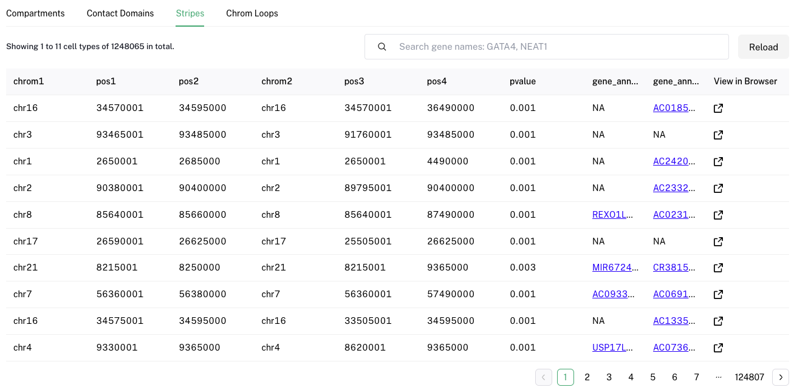

# Introduction

The human genome exhibits a complex hierarchical 3D organization. Utilizing genome-wide 3D genome mapping technologies such as Hi-C, HiChIP, and ChIA-PET, the spatial structure of the 3D genome can be parsed and visualized at multiple levels, including megabase-scale A/B compartments, submegabase-scale topologically associated domains (TADs), stripes, and kilobase-scale chromatin loops. 

3D genome organization is frequently linked to long-distance gene regulation, which in turn controls development and cell fate commitment. For example, the spatial segregation of chromatin into A and B compartments is a hallmark of genome organization and is associated with distant gene expression. Stripes, recently observed in Hi-C maps, provide evidence for the loop extrusion model. These stripes are enriched in super enhancers (H3K27ac signals), though repressive stripes (H3K27me3 signals) are also observed. Transcription factors can induce successive changes in chromatin state and genome architecture, enabling gene-regulatory rewiring during cell reprogramming. However, the multi-layered 3D genome organization and its relationship with the epigenome and gene expression within complex tissue organs and diverse cell types remain largely unknown. 

Here, we present **EXPRESSO (Exploration of Regulatory Epigenome with Spatial and Sequence Observations)**, a multi-omics database designed to explore and visualize multi-layered 3D genomic features and their associations with the epigenome and gene expression across 46 different tissues in the human genome. 


---

## Contents
- [Datasets](#datasets)
- [Search Samples](#search-samples)
  - [Autocomplete search](#autocomplete-search) 
  - [Individual sample page](#individual-sample-page)
  - [Genome Browser](#genome-browser)
  - [File Table](#file-table)
    - [Compartments Table](#compartments-table)
    - [Contact Domain Table](#contact-domain-table)
    - [Stripe Table](#stripe-table)
    - [Chromatin Loop Table](#chromatin-loop-table)
- [Search Genes](#search-genes)
- [APIs](#apis)
- [Download](#download)
---

## Datasets

EXPRESSO collects 1360 3D genomic datasets (Hi-C, ChIA-PET, HiChIP) from public repositories (by 2024 Oct)


---

## Search Samples

The "Summary Table" in the Data Portal allows users to query the database for specific samples based on various criteria such as tissue type, disease state, or experimental conditions. Click the **View** column to access a dedicated page of a specific sample.


#### Autocomplete search
Users can also search directly via sample names


#### Individual sample page
Each individual sample page consists of four parts: Sample Information, File Download, Genome Browser and File Table.
Sample Information is for basic sample information 
File Download is the download link for A/B compartments, contact domains, stripes and chromatin loops.


---

#### Genome Browser

We developed an in-house genome browser to visualize different 3D genomic structures such as compartment, contact domains, chromatin loops, stripes, etc.


#### File Table
###### 1. Compartments Table
This table categorizes genes based on the A/B compartments of the genome, including a quantitative measure of compartment strength:
- **gene**: Gene identifier
- **compartment**: Indicates whether the gene is in an A or B compartment
- **compartment E1 value**: Eigenvalue quantifying the strength of the compartment association


###### 2. Contact Domain Table
This table outlines the boundaries of contact domains related to specific genes:
- **gene**: Gene identifier
- **contact domain boundary**: Whether it's boundary or domain gene


###### 3. Stripe Table
Details about observed stripes in Hi-C maps
- **chrom1**: Chromosome
- **pos1**: Start position of the stripe on chrom1
- **pos2**: End position of the stripe on chrom1
- **chrom2**: Corresponding chromosome, typically the same as chrom1
- **pos3**: Start position of the stripe on chrom2
- **pos4**: End position of the stripe on chrom2
- **pvalue**: Statistical significance of the stripe observation
- **gene_annotation_1**: Annotation of the first anchor
- **gene_annotation_2**: Annotation of the second anchor


###### 4. Chromatin Loop Table
This table provides detailed information on chromatin loops, highlighting the interaction between two anchors:
- **chrom1**: Chromosome of the first anchor
- **start1**: Start position of the first anchor
- **end1**: End position of the first anchor
- **chrom2**: Chromosome of the second anchor
- **start2**: Start position of the second anchor
- **end2**: End position of the second anchor
- **counts**: PET counts indicating the strength of the loop
- **gene_annotation_1**: Gene annotation associated with the first anchor
- **gene_annotation_2**: Gene annotation associated with the second anchor


---

## Search Genes

Users can search for genes of interest using identifiers like gene names, symbols, or accession numbers. Results provide detailed gene profiles, including expression data, functional annotations, and related literature.

---

## APIs

The EXPRESSO API enables programmatic access to all functionalities of the platform, allowing developers to integrate EXPRESSO's capabilities into their own applications or workflows.

| Type | Required resource | API endpoint urls |
|------|------------------|-------------------|
| Search metadata | | |
| Sample | | `/dataset/{gsm_id}` |
| Samples | | `/datasets/tissue={string}&heatlth_status={string}&biomaterial={string}` |
| Files | | `/files/{sample_name}` |
| Seach genomic features | | |
| Compartments | | `/compartments?sample_name={sample_name}` |
| Domains | | `/domains?sample_name={sample_name}` |
| Stripes | | `/stripes?sample_name={sample_name}` |
| Loops | | `/loops?sample_name={sample_name}` |
| Search gene associated genomic features | | |
| Compartments | | `/gene/{gene_name}/compartment` |
| Domains | | `/gene/{gene_name}/domain` |
| Stripes | | `/stripes?gene_id={gene_id}` |
| Loops | | `/loops?gene_id={gene_id}` |
| Download | | |
| File | | `/download/{sample_name}/{file_type}` |


#### Search a specific library by id

`GET` `/dataset/{gsm_id}`

###### Example 1: Search dataset GSM4072698

###### Request
```
https://expresso.sustech.edu.cn/api/sample/GSM4072698
```

###### Response
```json
{
    "id": "GSM4072698",
    "data_source": "GEO",
    "data_type": "in-situ Hi-C",
    "tissue": "Colon",
    "health_status": "Cancer",
    "biomaterial_type": "Tissue", 
    "enzyme_linker": "MboI",
    "factor": "NA",
    "cell_line_name": "NA"
}
```

#### Search datasets by one or multiple conditions

`GET` `/datasets/tissue={string}&health_status={string}&biomaterial={string}`

###### Example 1: Search all datasets from cancer

###### Request
```
https://expresso.sustech.edu.cn/api/samples?health_status=cancer&limit=10&offset=1
```

###### Response
```json
[
{
    "id": "GSM5369938",
    "data_source": "ENCODE",
    "data_type": "ChIA-PET",
    "tissue": "Colon",
    "health_status": "Cancer",
    "biomaterial_type": "Cell Line",
    "enzyme_linker": "ACGGAATCTTAATCTGACT",
    "factor": "RNAPII",
    "cell_line_name": "HCT116"
},
{
    "id": "GSM5369939",
    "data_source": "ENCODE",
    "data_type": "ChIA-PET",
    "tissue": "Colon"
}
]
```

###### Example 2: Search all datasets from liver or heart

###### Request
```
/datasets/tissue=liver,heart
```

###### Response
```json
{
    gsm_id: '',
    health_status: ''
}
```

###### Example 3: Search all cancer datasets from heart and biomaterials are from tissue

###### Request
```
/datasets/tissue=heart&health_status=cancer&biomaterial=tissue
```

###### Response
```json
{
    gsm_id: '',
    health_status: ''
}
```

#### Search Compartments E1 score of samples

`GET` `/compartments?sample_name={sample_name}`

###### Example 1: Search Compartments E1 score of sample GSM2109214

###### Request
```
https://expresso.sustech.edu.cn/api/compartments?sample_name=GSM2109214
```

###### Response
```json
{
    "itemCount": 57135,
    "items": [
        {
            "sample_name": "GSM2109214",
            "gene_id": "SOX2P2",
            "value": 0.2084
        },
        {
            "sample_name": "GSM2109214",
            "gene_id": "FTBDI",
            "value": 0.4628
        },
        {
            "sample_name": "GSM2109214",
            "gene_id": "MARGS",
            "value": 0.493
        }
    ]
}
```

#### Search contact domains from samples

`GET` `/domains?sample_name={sample_name}`

###### Example 1: Search Boundary and domain genes of sample GSM4072698

###### Request
```
https://expresso.sustech.edu.cn/api/domains?sample_name=GSM4072698
```

###### Response
```json
{
    "itemCount": 54718,
    "items": [
        {
            "sample_name": "GSM4072698",
            "gene_id": "PERM1",
            "value": "D"
        },
        {
            "sample_name": "GSM4072698",
            "gene_id": "AL031282.2",
            "value": "D"
        },
        {
            "sample_name": "GSM4072698",
            "gene_id": "SUB35E2A",
            "value": "D"
        }
    ]
}
```

#### Search Stripes from samples

`GET` `/stripes?sample_name={sample_name}`

###### Example 1: Search Stripes of sample GSM2109214

###### Request
```
https://expresso.sustech.edu.cn/api/stripes?sample_name=GSM2109214
```

###### Response
```json
{
    "itemCount": 124806S,
    "items": [
        {
            "chrom1": "chr16",
            "pos1": 34570001,
            "pos2": 34595000,
            "chrom2": "chr16",
            "pos3": 34570001,
            "pos4": 34490000,
            "id": "ENCFF02IVUU",
            "pvalue": 0.001,
            "gene_anno_1": "NA",
            "gene_anno_2": "AC018558.1,AC018558.2,AC018558.3,AC018558.6,AC018558.5,AC023824.1,AC023824.2",
            "h3k27ac_1": "NA",
            "h3k27me3_1": "NA",
            "h3k27me3_2": "NA",
            "ctcf_1": "NA"
        }
    ]
}
```

#### Search Chromatin loops from samples

`GET` `/loops?sample_name={sample_name}`

###### Example 1: Search Chromatin loops from sample GSM4072698

###### Request
```
https://expresso.sustech.edu.cn/api/loops?sample_name=GSM4072698
```

###### Response
```json
{
    "itemCount": 3145,
    "items": [
        {
            "chrom1": "chr1",
            "start1": 11752000,
            "end1": 11753000,
            "chrom2": "chr1",
            "start2": 11753000,
            "end2": 11790000,
            "sample_name": "GSM4072698",
            "count": 23.0,
            "gene_anno_1": "NA",
            "gene_anno_2": "NA"
        }
    ]
}
```

---

We would love to hear your suggestions. Please ask your questions in the issue page, and we will respond as soon as possible.


---

We hope you find EXPRESSO useful for your research needs. Happy exploring!