### Contents
3. [Search Samples](#search-samples)
4. [Search Genes](#search-genes)
5. [Multi-omics Analysis](#multi-omics-analysis)
   - [Gene Compartment and Expression](#gene-compartment-and-expression)
   - [Stripe Atlas](#stripe-atlas)
   - [Chromatin Loop Enriched Transcription Factors](#chromatin-loop-enriched-transcription-factors)
6. [Download](#download)
7. [API](#api)

---

### Navigation Menu
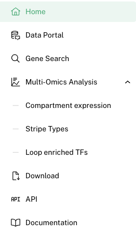
You can navigate through the **EXPRESSO** platform using various menus to access specific functionalities:

- **Data Portal**: Search for individual samples based on various criteria. [Search in Data Portal](#data-portal)
- **Gene Search**: Look up individual genes to view detailed information and analytics. [Search Genes](#gene-search)
- **Multi-Omics Analysis**: Perform comprehensive multi-omics analyses online with our integrated tools. [Conduct Multi-Omics Analysis](#multi-omics-analysis)
- **Download**: Access and download individual files or compiled datasets as per your requirements. [Download Files](#download)
- **API**: Interact programmatically with our database using the API for automated data retrieval and integration. [Use API](#api)

### Data Portal

The "Summary Table" allows users to query the database for specific samples based on various criteria such as tissue type, disease state, or experimental conditions. Click the **View** column to access a dedicated page of a specific sample.
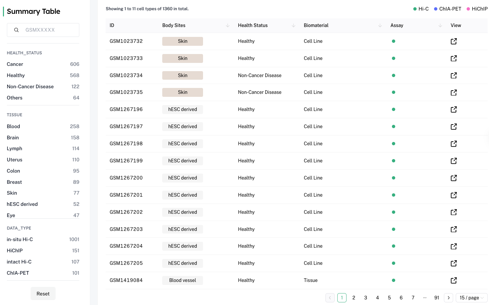

### Individual Sample Page

Each individual sample page consists of four parts: Sample Information, File Download, Genome Browser, and File Table.
Sample Information is for basic sample information 
File Download is the download link for contact matrix, A/B compartments, contact domains, stripes, and chromatin loops.

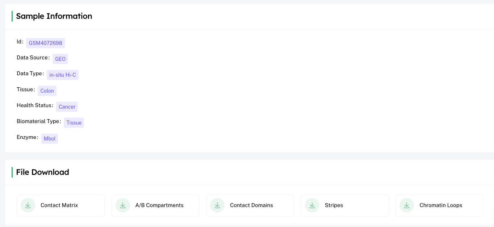
---

### Genome Browser

We developed an in-house genome browser to visualize different 3D genomic structures such as compartment, contact domains, chromatin loops, stripes, etc.

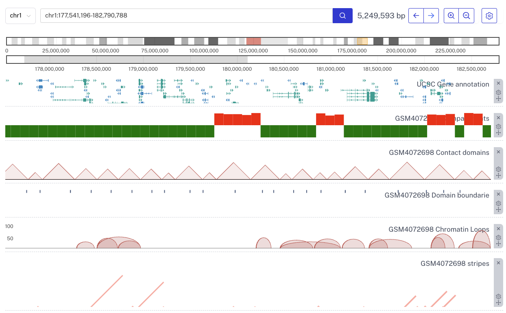

### File Table
#### 1. Compartments Table
This table categorizes genes based on the A/B compartments of the genome, including a quantitative measure of compartment strength:
- **gene**: Gene identifier
- **compartment**: Indicates whether the gene is in an A or B compartment
- **compartment E1 value**: Eigenvalue quantifying the strength of the compartment association

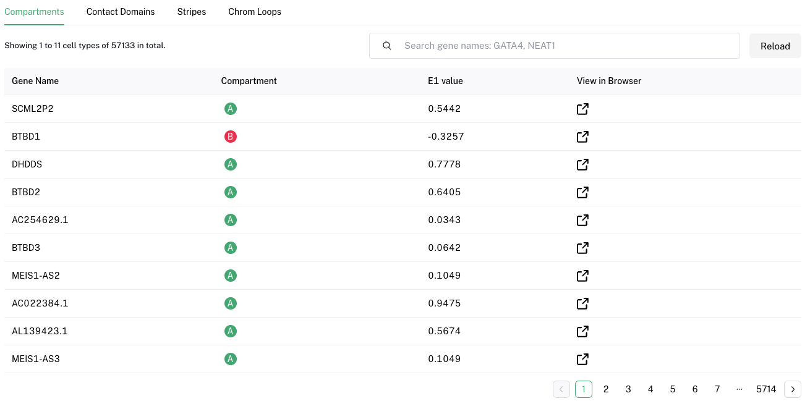

#### 2. Contact Domain Table
This table outlines the boundaries of contact domains related to specific genes:
- **gene**: Gene identifier
- **contact domain boundary**: Whether it's boundary or domain gene
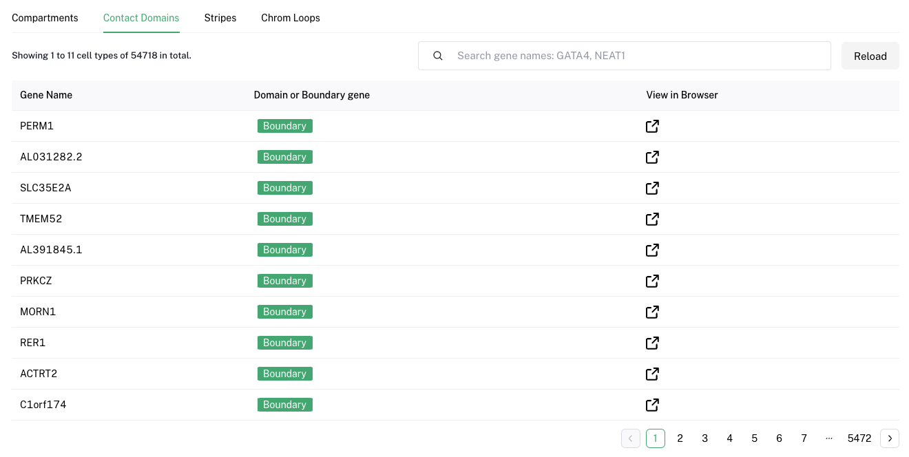

#### 3. Stripe Table
Details about observed stripes in Hi-C maps
- **chrom1**: Chromosome
- **pos1**: Start position of the stripe on chrom1
- **pos2**: End position of the stripe on chrom1
- **chrom2**: Corresponding chromosome, typically the same as chrom1
- **pos3**: Start position of the stripe on chrom2
- **pos4**: End position of the stripe on chrom2
- **pvalue**: Statistical significance of the stripe observation
- **gene_annotation_1**: Annotation of the first anchor
- **gene_annotation_2**: Annotation of the second anchor
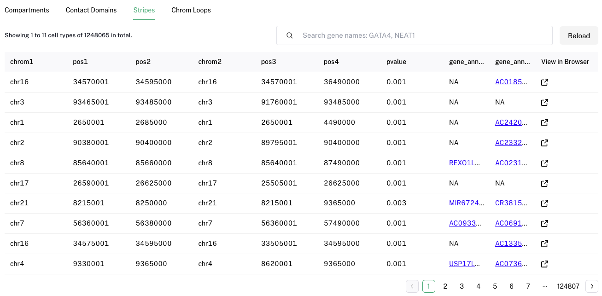

#### 4. Chromatin Loop Table
This table provides detailed information on chromatin loops, highlighting the interaction between two anchors:
- **chrom1**: Chromosome of the first anchor
- **start1**: Start position of the first anchor
- **end1**: End position of the first anchor
- **chrom2**: Chromosome of the second anchor
- **start2**: Start position of the second anchor
- **end2**: End position of the second anchor
- **counts**: PET counts indicating the strength of the loop
- **gene_annotation_1**: Gene annotation associated with the first anchor
- **gene_annotation_2**: Gene annotation associated with the second anchor
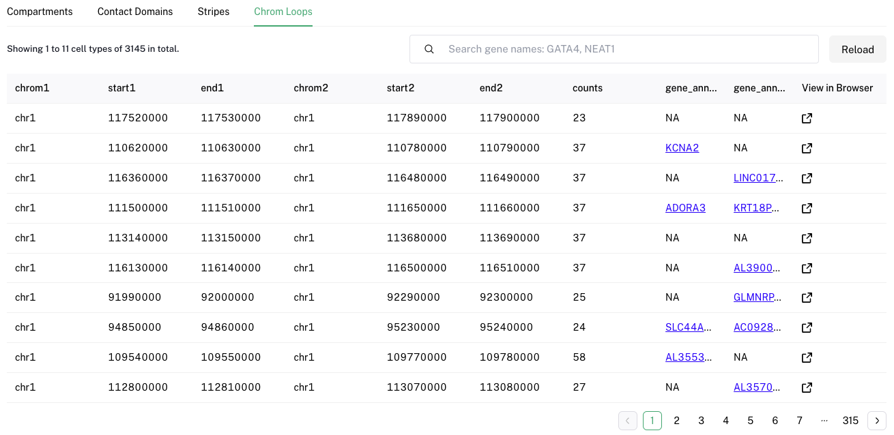

---

### Search Genes

Users can search for genes of interest using identifiers like gene names, symbols, or accession numbers. Results provide detailed gene profiles, including expression data, functional annotations, and related literature.

---

### Multi-omics Analysis

#### Gene Compartment and Expression

This section focuses on the analysis of gene expression within different cellular compartments, providing insights into the functional dynamics of genes in various cellular contexts.

###### Step by step guidance
1.Enter the gene name in the search box.
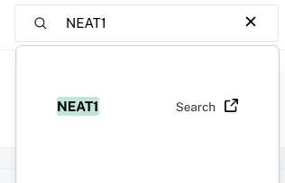

2.Interpret Results
2.1 Distribution of samples in A and B compartments across tissues.
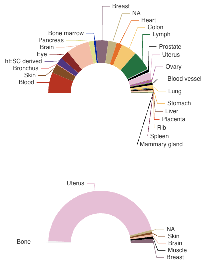

2.2 Distribution of samples in A and B compartments by health status.
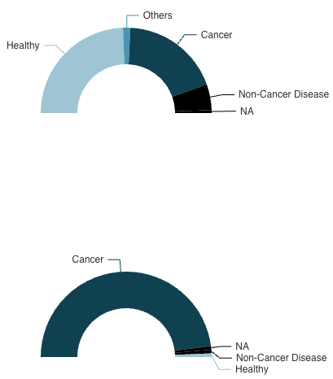

2.3 Distribution of samples in A and B compartments by biomaterial.
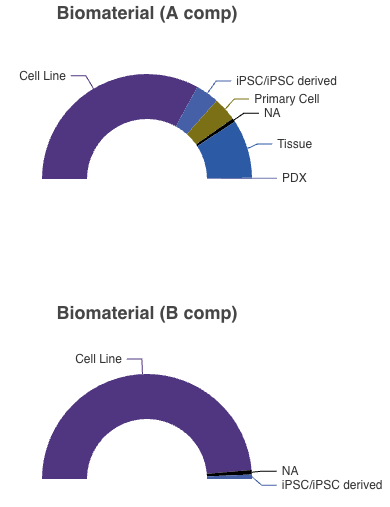

2.4 Distribution of E1 values in samples.
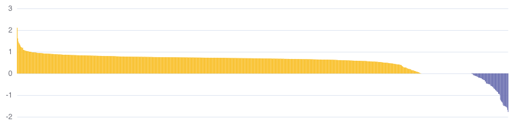

2.5 Compare gene expression values of samples in A or B compartments.
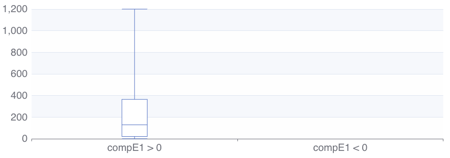

#### Stripe Atlas

The Stripe Atlas visualizes gene expression across different tissues and developmental stages, offering a stripe-based graphical representation that highlights tissue-specific gene activity.

###### Step by step guidance
1.Search Stripe Panel
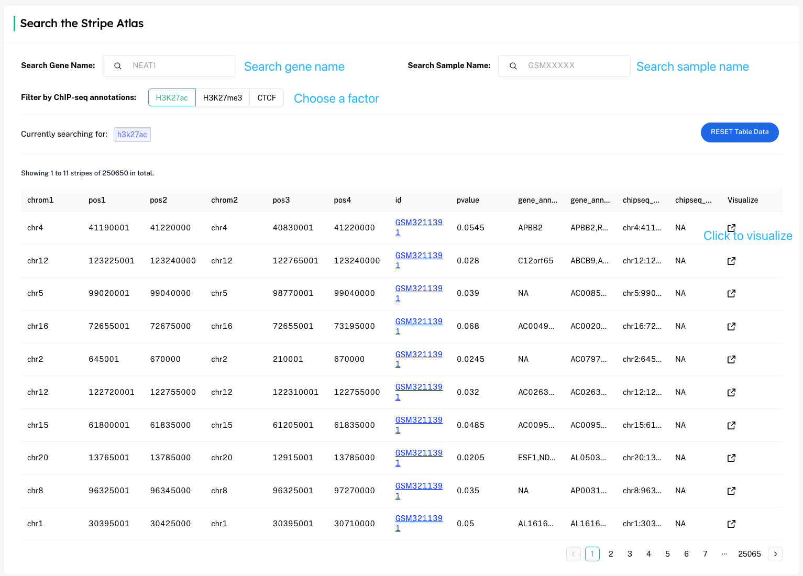

2.Interpret Results
The results page shows visualizations in tracks from top to bottom: gene annotation, compartment, contact matrix, contact domain, and ChIP-seq coverage.
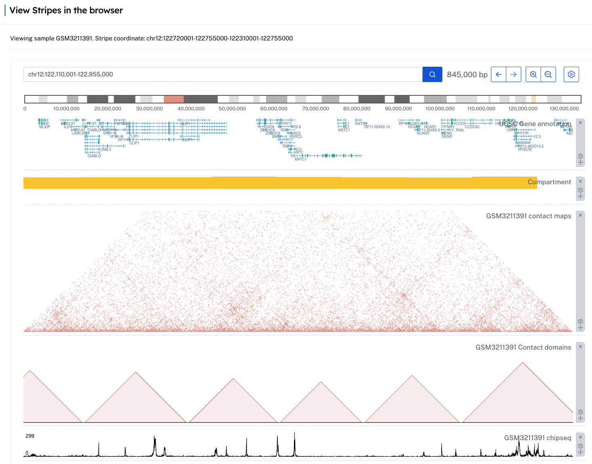

#### Chromatin Loop Enriched Transcription Factors

This analysis tool identifies transcription factors that are likely to be enriched in specific chromatin loops, facilitating the understanding of transcriptional regulation through 3D chromatin structure.

###### Step by step guidance
1.Select a Transcription Factor
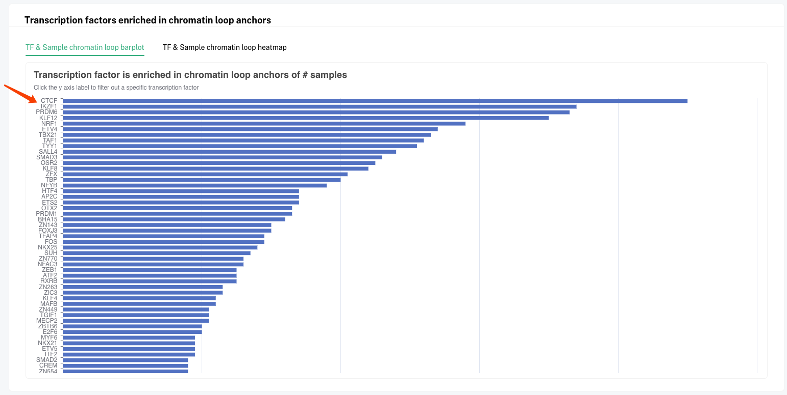

2.Interpret Results
The image below shows a detailed view of the top ten samples in the CTCF enrichment table, featuring the CTCF motif logo and relevant statistics for each biosample. Table columns: P-value, Probability of observing the motif by chance. logP, Logarithm of the P-value. Target Ratio, Proportion of target sequences containing the motif. Background Ratio, Proportion of background sequences containing the motif. bgSTD, Variability of motif occurrence in background sequences.
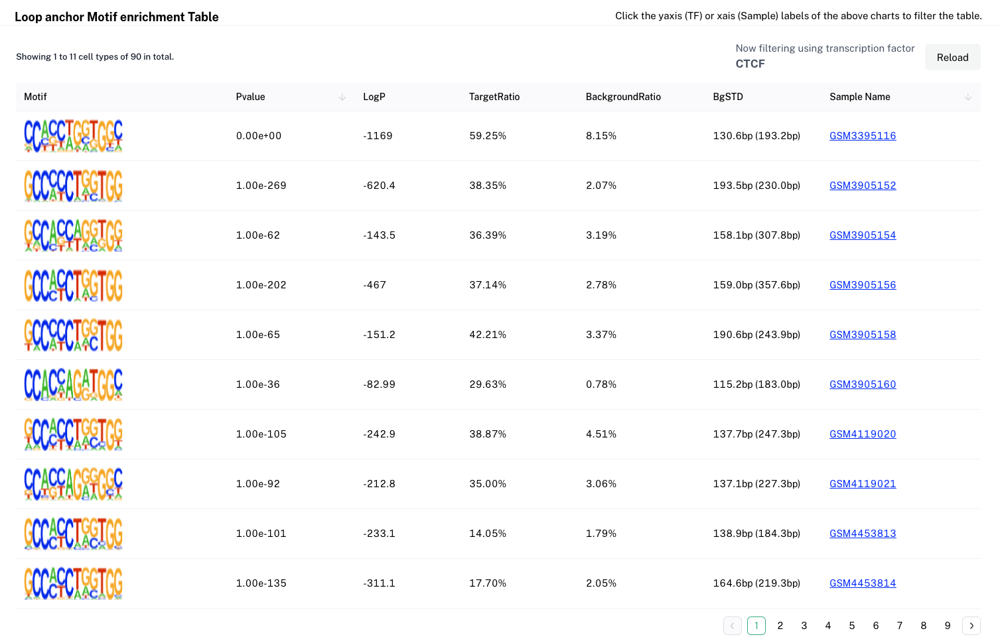
---

### Download

EXPRESSO provides downloadable content, including raw data files, processed results, and customizable reports, to support offline analysis and integration into other research projects. Please refer to the Download page for details.

---

### API

The EXPRESSO API enables programmatic access to all functionalities of the platform, allowing developers to integrate EXPRESSO's capabilities into their own applications or workflows. Detailed documentation is available to facilitate API usage.

---

For more information, please refer to the detailed documentation or contact our support team.

---

We hope you find EXPRESSO useful for your research needs. Happy exploring!